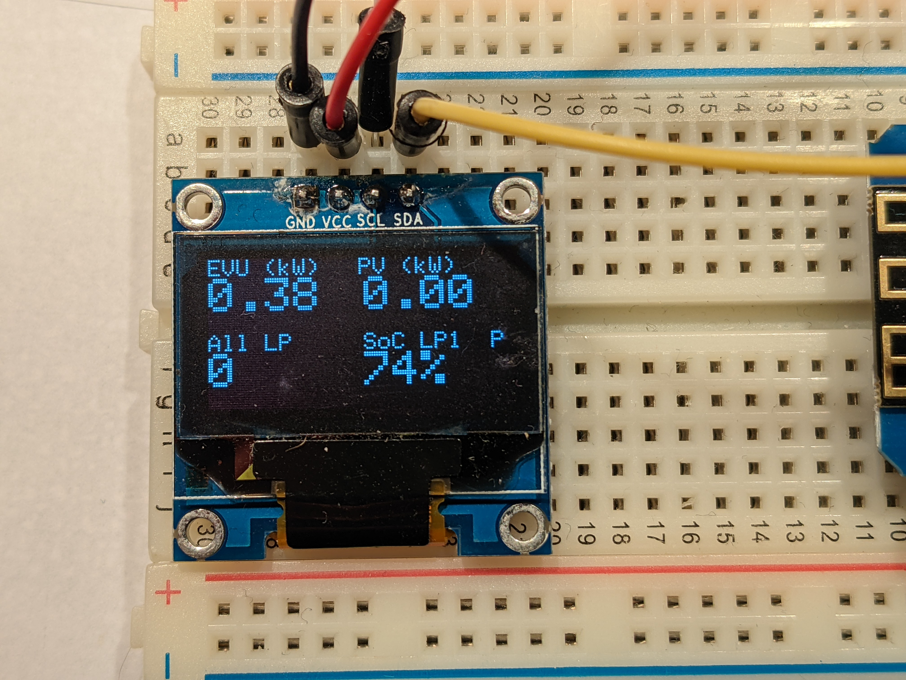
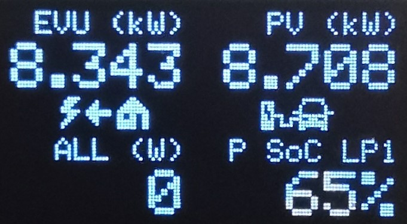
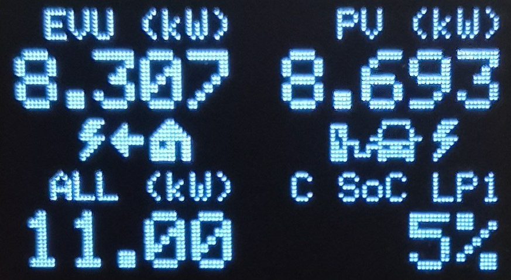

# openWB_OLEDDisplay
OpenWB status display using ESP8266 and 0.96" OLED Display.
Displays current EVU (grid), PV and combined power of all charging ports plus SoC and status of up to the first two loadpoints (LP1 / LP2). The display automatically cycles between LP1 and LP2 if a second loadpoint is present.

Allows OTA updates via integrated WebBrowser on <ip of ESP>/update

## Migration Note (HTTP Polling vs. MQTT)
This version replaces the previous MQTT subscription mechanism with periodic HTTP polling of a single configured host/endpoint. All power and status values are now parsed from a JSON payload returned by that HTTP endpoint.

### Why the change?
* Simplifies setup (no MQTT broker credentials / topics required)
* Centralizes all data in one HTTP request
* Makes polling interval configurable (`POLL_INTERVAL_MS`)

### What you need to configure now
In `openWB_OLEDDisplay.ino` near the top:
```
const char* HTTP_HOST = "192.168.10.140";   // openWB host/IP
const uint16_t HTTP_PORT = 80;               // Port (usually 80)
const char* HTTP_PATH = "/api/status";      // Path to JSON status
const unsigned long POLL_INTERVAL_MS = 5000; // Polling interval in ms
```
Adjust these to match your backend HTTP API. If your API path or JSON structure differs, adapt either `HTTP_PATH` (jq filter) or the parsing logic in `parser.cpp` (`ParseEvccState`).

### Expected / Minimized JSON structure (EVCC example)
The sketch targets the evcc state endpoint with a jq filter that reduces the payload to only required fields for up to two loadpoints:

`/api/state?jq={gridPower:.grid.power,pvPower:.pvPower,loadpoints:[.loadpoints[0],.loadpoints[1]]|map(select(.!=null)|{chargePower:.chargePower,soc:(.vehicleSoc//.soc),charging:.charging,plugged:(.connected//.plugged)})}`

Resulting minimized JSON (example with two loadpoints):
```
{
  "gridPower": -1234,   // W (negative = export, positive = import)
  "pvPower": 3456,      // W PV generation
  "loadpoints": [
    {"chargePower": 2100, "soc": 78, "charging": true,  "plugged": true},
    {"chargePower":    0, "soc": 55, "charging": false, "plugged": true}
  ]
}
```
Field Mapping:
* `gridPower` -> EVU / Grid (import/export). Display shows absolute value; direction arrow uses sign.
* `pvPower` -> PV power (always treated as generation, absolute value shown).
* Sum of `loadpoints[*].chargePower` -> total charge power (`LP_all_W`).
* Each element of `loadpoints` (up to 2) -> internal loadpoint array (`lps[0]`, `lps[1]`) with `soc`, `charging`, `plugged`.

If only one loadpoint exists, the array has a single entry and cycling is disabled automatically.

If your backend differs, adjust the jq filter in `HTTP_PATH` or extend the parsing logic in `parser.cpp`.

### Library dependency
* [ArduinoJson](https://arduinojson.org/) (install via Arduino Library Manager) for JSON parsing.

### Legacy MQTT status endpoint
The built-in web endpoint `/` still works for health checks. The previous `MQTT status` handler now simply reports that MQTT is disabled.

Sketch assumes SPI Display, wiring for Wemos D1 & compatible:
* SCL: D1
* SDA: D2
* GND: GND
* VCC: 3.3V

# Configuration

## WiFi Setup
1. Copy `wifi_config_template.py` to `wifi_config.py`
2. Edit `wifi_config.py` and enter your WiFi credentials:
   - `WIFI_SSID`: Your WiFi network name
   - `WIFI_PASSWORD`: Your WiFi password
   - `HOSTNAME`: Device hostname (optional)
   - `WIFI_TIMEOUT_SECONDS`: Connection timeout (default: 20)
   - `WIFI_RETRY_DELAY`: Delay between connection attempts (default: 0.5)

## Other Configuration
1. Update `HTTP_HOST`, `HTTP_PATH`, and optionally `POLL_INTERVAL_MS` in the main file.
2. Install ArduinoJson if not already available.
3. Optionally adjust `LP_CYCLE_INTERVAL_MS` (default 7000 ms) to change how fast the screen switches between LP1 and LP2 when two loadpoints are present.
4. Flash the sketch. First successful poll will update the display.

If you see only LP1, verify a second loadpoint is exposed by the backend and included by the jq filter.

If data does not appear, open the serial monitor (115200 baud) to inspect log lines for HTTP / JSON parse errors.

### Runtime Log Zugriff über HTTP
Zusätzlich zur seriellen Ausgabe werden die letzten Log-Zeilen im RAM gepuffert und stehen unter folgenden Endpunkten zur Verfügung:
* `/logs` – Plain-Text Liste der letzten ca. 120 Zeilen (FIFO, älteste zuerst)
* `/logs/clear` – Puffer leeren (fügt danach eine Marker-Zeile `<log cleared>` ein)

Anpassung der Puffergröße über `LOG_BUFFER_LINES` und max. Zeilenlänge über `LOG_MAX_LINE_LEN` im Sketch.

# Example


# Graphic Symbols
Add `#define UI_GRAPHIC_STYLE` to change from text output to graphic output. There are symbols for energy import/export and charging status (unplugged | plugged | charging).
Output is in Watt (W) if less than 1000 W and in kilo Watt (kW) if ≥ 1000 W. Above 10 kW it shows fewer decimal digits.

# Examples for Graphic Symbols
Example plugged car


Example for charging car


Symbols:
Import of energy


Export of energy


Unplugged


Plugged


Charging

