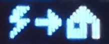
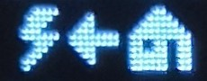
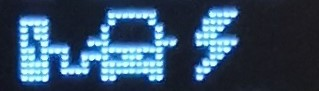

# openWB_OLEDDisplay
OpenWB status display using ESP8266 and 0.96" OLED Display.
Displays current EVU, PV and combined power of all charging ports plus SoC of charge port 1 and if this charge port is plugged in (P) or charging (C).

Allows OTA updates via integrated WebBrowser on <ip of ESP>/update

Sketch assumes SPI Display, wiring for Wemos D1 & compatible:
* SCL: D1
* SDA: D2
* GND: GND
* VCC: 3.3V

# Configuration
You need to enter SSID, PW and IP of openWB in .ino source file

# Example

# Graphic Symbols
add #define UI_GRAPHIC_STYLE to change from text output to some grafic output. There are symbols added for Energy import|export and for status of the charge port unplugged|plugged|charging.
The text was moved to fit better on screen and give some space for the grafics. Output is in Watt (W) if less then 1000W and in kilo Watt (kW) if more or equal 1000W. if its above 10 kW it shows only 2 position after decimal point.

# Examples for Graphic Symbols
Example plugged car

Example for charging car

Symbols:
Import of energy

Export of energy

Unplugged

Plugged

Charging

